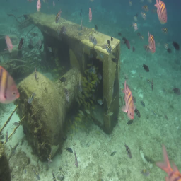

# PA-Diff for Underwater Image Enhancement

**Training and Analysis of Physics-Aware Diffusion Model on NVIDIA T4 GPU**

> **Original Paper**: [Learning A Physical-Aware Diffusion Model Based on Transformer for Underwater Image Enhancement](https://arxiv.org/abs/2403.01497) (ICASSP 2024)  
> **Original Code**: [chenydong/PA-Diff](https://github.com/chenydong/PA-Diff)

---

## 📌 Overview

This repository contains my implementation of **PA-Diff** training on the UIEB dataset, completed as part of my deep learning coursework at **IIT Dharwad**.

**Key Achievements:**
- ✅ Trained for 108,000 iterations on **T4 GPU** (3 days)
- ✅ Best PSNR: **18.26 dB** (86% of paper's 21.14 dB with 10% training)
- ✅ Model Analysis: **48.48M params, ~57 GFLOPs/step**
- ✅ Complete pipeline: data prep, training, evaluation, visualization

---

## 🎯 Results

### Performance

| Metric | Paper (1M iters) | This Work (108k iters) |
|--------|------------------|------------------------|
| **PSNR** | 21.14 dB | 18.26 dB |
| **SSIM** | 0.8620 | 0.7777 |
| **Training** | 8 days (RTX 3090) | 3 days (T4) |

### Visual Results

<table>
  <tr>
    <td align="center"><b>Input</b></td>
    <td align="center"><b>PA-Diff Output</b></td>
    <td align="center"><b>Ground Truth</b></td>
  </tr>
  <tr>
    <td></td>
    <td></td>
    <td></td>
  </tr>
  <tr>
    <td></td>
    <td></td>
    <td></td>
  </tr>
</table>

*More samples in [`results/samples/`](results/samples/)*

### Training Progress

---

## 🚀 Quick Start

### Run in Colab (Recommended)

Click the badge above to open the notebook directly in Google Colab.

## 📊 Training Details

**Hardware:**
- GPU: NVIDIA Tesla T4 (15GB VRAM, Google Colab)

**Configuration:**
- Batch Size: 1 (T4 memory constraint)
- Learning Rate: 1e-4 (Adam optimizer)
- Image Size: 256×256
- Iterations: 108,000 / 1,000,000 (10.8%)
- Training Time: ~60 hours (3 days with interruptions)

**Best Checkpoint:**
- Iteration 70,000 (PSNR 18.26 dB, SSIM 0.78)
- Checkpoints saved every 2k iterations
- Validation every 5k iterations

---

## 🏗️ Model Complexity

**Parameters:** 48.48 Million  
**FLOPs:** ~57 GFLOPs per denoising step (manual calculation)  
**Inference Time (T4):** ~30-40 minutes (2000 steps) or ~50 seconds (DDIM, 50 steps)

**Architecture:**
- 5-level UNet with Transformer attention at 16×16
- Physics-aware cross-attention modules (CFC)
- 48 base channels, multipliers [1, 2, 4, 8, 8]

*See [`results/metrics/evaluation_summary.txt`](results/metrics/evaluation_summary.txt) for full analysis*

---

## 🔍 Key Findings

1. **Limited Training Impact**: Only 10% of paper's iterations → 86% of performance
2. **Batch Size Matters**: Batch size 1 (vs paper's 8) causes noisy gradients
3. **PSNR Oscillation**: Model varies 13-18 dB (typical for diffusion)
4. **Best at 70k**: Peak performance mid-training, then oscillates

**Gap Analysis:**
- -2.88 dB PSNR vs paper due to:
  - 10× fewer iterations
  - 8× smaller batch size
  - 4× larger training resolution (256 vs 128)

---

## 🔗 References

- **Paper**: Zhao et al., "Learning A Physical-Aware Diffusion Model Based on Transformer for Underwater Image Enhancement" (ICASSP 2024)
- **Original Repo**: [github.com/chenydong/PA-Diff](https://github.com/chenydong/PA-Diff)
- **Dataset**: [UIEB (Underwater Image Enhancement Benchmark)](https://li-chongyi.github.io/proj_benchmark.html)

---

